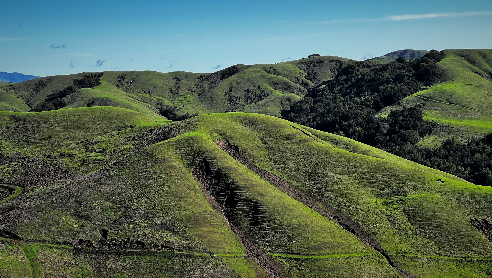
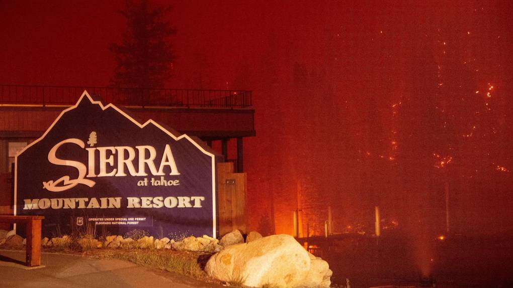

## My Earth Data Analytics Portfolio
---------------------------------------------
### Project #1
* [Anchorage, AK:  Plot of mean annual temperature for the past 68 years](https://misterskye.github.io/notebooks/ncei_temp_anchorage.html)
  
   

  Paxson Woelber [CC BY-SA 3.0](https://en.m.wikipedia.org/wiki/File:Anchorage,_Alaska.JPG)

### Project #2
* [Analyzing the annual maximum streamflow of the San Gregorio Creek reveals a notable correlation between heavy rain years and increased landslides in the region](https://misterskye.github.io/notebooks/SanGregorioCreek_time-series.html)

  

### Project #3
* [The 2021 Caldor Fire, a destructive wildfire in Northern California, significantly impacted the region's vegetation](https://misterskye.github.io/notebooks/NDVI_Analysis.html)

  

  Josh Edelson/AFP via Getty Images

### Project #4
* [Looking At The Fire Density and Burn Ratio Values for the State of California, a 30-Year Perspective](https://misterskye.github.io/notebooks/vector_fire_analysis.html).

  
  
  2023 AgInfo.net, ['USDA Investing Funds to Reduce Wildfire Risk'](https://www.aginfo.net/report/55257/California-Ag-Today/USDA-Investing-Funds-to-Reduce-Wildfire-Risk)

